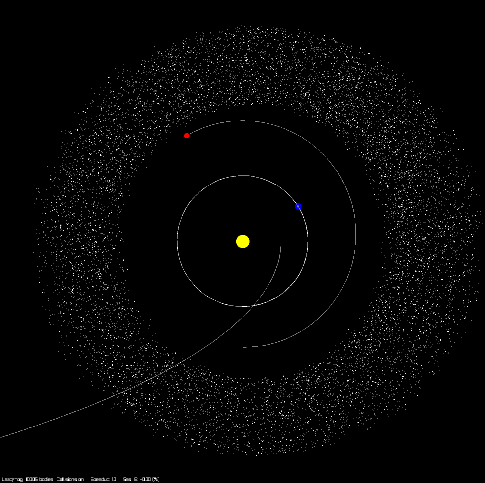

# Orbital

> Simulation of gravity and orbital mechanics (heliocentric) for fun.

### Keybinds:

- Q: quit
- R: reverse
- +/-: time speedup
- Click: follow / pan to
- Scroll-wheel: zoom
- K: change integrator

## Features

- Visualization with:
  - Zoom
  - Pan
  - Follow orbits

- Modeling of:
  - Earth
  - Sun
  - Mars
  - Haley's Comet
  - Asteroids

- Choice of Integrator:
  - Euler
  - Leapfrog
  - Leapfrog "KDK"

- Collisions between bodies (simplified using spatial hashing)
- Time Control / Reversibility (must use a reversible integrator for correctness)
- Orbital trails

## Maybe going to implement

- Solar Wind / Solar particles
- Comet trails
